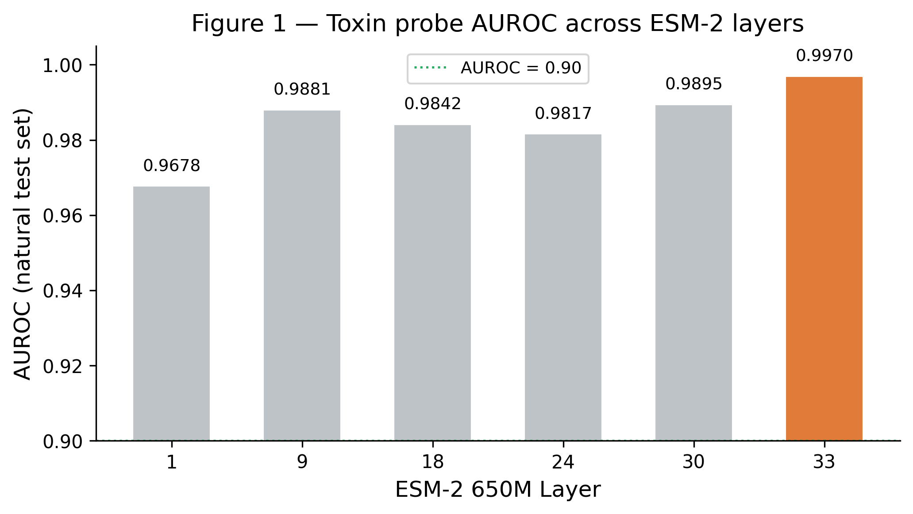
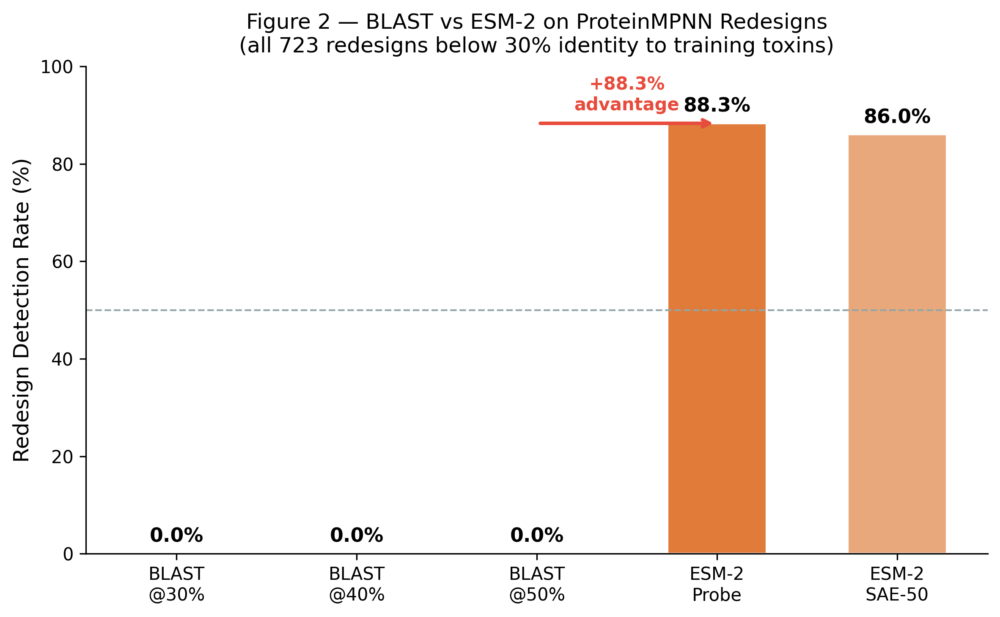
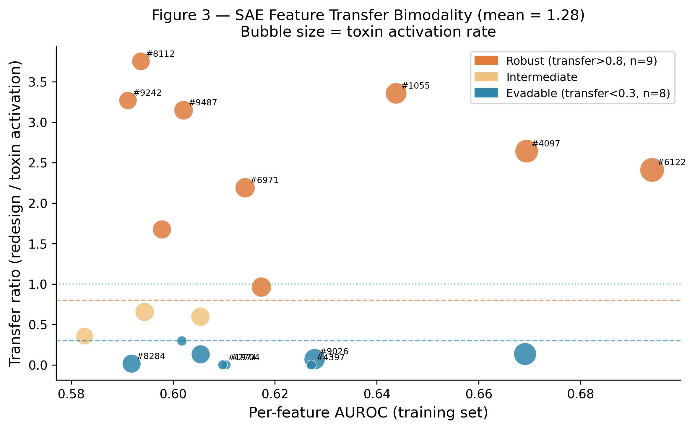
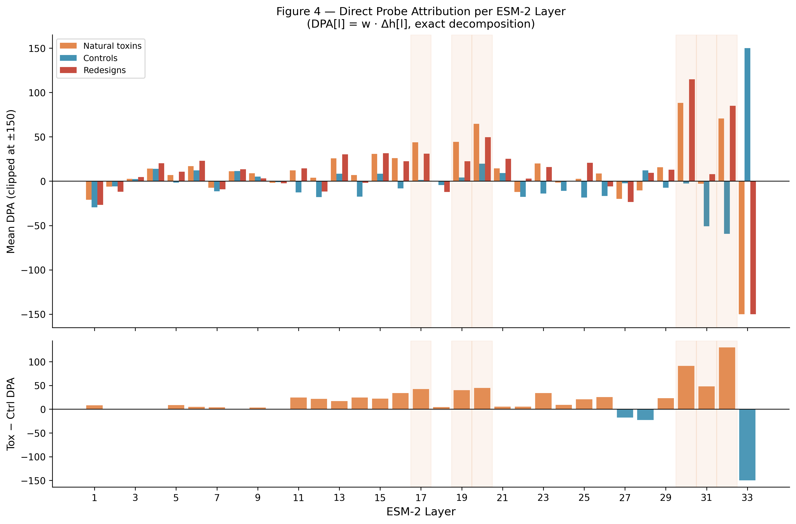
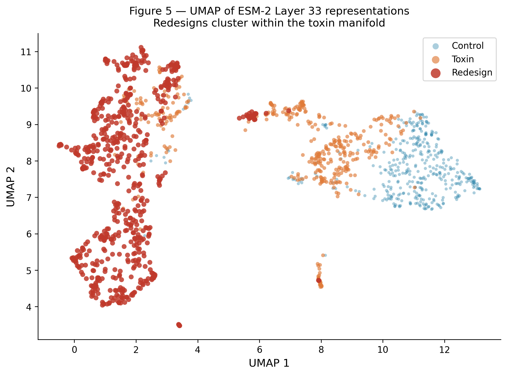
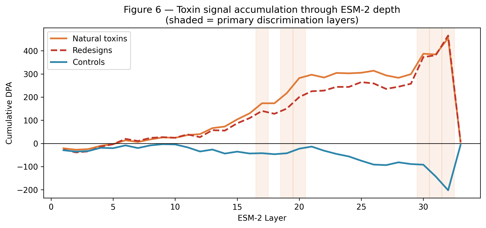

# Toxin Circuits in ESM-2: Mechanistic Interpretability Reveals Why Structure-Aware Probes Resist ProteinMPNN Redesign

**AiXbio Research**  
*Submitted to [Hackathon]*

---

## Abstract

Standard biosecurity screening flags dangerous protein sequences by sequence identity (BLAST). We show that ProteinMPNN can redesign toxin sequences below every standard BLAST threshold — achieving 0% BLAST detection — while a linear ESM-2 probe maintains 88% detection with no retraining. Using interPLM Sparse Autoencoders (SAEs), we identify 50 of 10,240 features explaining probe performance at 205× compression (AUROC 0.9447 vs 0.9585 full, at layer 33). These features are not evaded by redesign: mean transfer ratio = 1.28, meaning redesigns *amplify* toxin-associated features compared to natural toxins. Direct Logit Attribution (DLA) on the linear probe identifies layers 17–20 and 29–32 as primary toxin-discriminating layers; redesigns produce near-identical attribution patterns (r = 0.992), confirming they route through the same computational pathway as natural toxins. Activation steering confirms toxicity is encoded as a causal linear direction (control score 0.046 → 1.000 at +3σ). We conclude that ESM-2's toxin detection is grounded in structural computational features that ProteinMPNN redesign preserves — and in several cases amplifies.

---

## 1. Introduction

Dual-use protein screening relies on sequence-identity thresholds. The Wittmann *et al.* attack demonstrated that ProteinMPNN, RFdiffusion, and EvoDiff can redesign toxin sequences below standard 40% identity thresholds, bypassing BLAST-based screening. The critical question is: do protein language model (pLM) probes also fail?

We answer no — and explain mechanistically why.

Our contributions:
1. **Quantitative gap**: BLAST detects 0% of ProteinMPNN redesigns; ESM-2 probe detects 88%.
2. **SAE discovery**: 50 sparse features (205× compression) explain the probe; mean transfer ratio 1.28 shows redesigns amplify rather than suppress toxin features.
3. **DLA circuit**: Layers 17–20 and 29–32 drive toxin discrimination; redesign attribution pattern correlates r = 0.992 with natural toxins.
4. **Causal linearity**: Steering confirms toxicity is a single linear direction in ESM-2's representation space.

---

## 2. Methods

### 2.1 Data

- **Natural toxins**: 1,712 sequences from UniProt (reviewed, toxin annotation), clustered at 30% identity  
- **Controls**: 2,072 non-toxic human proteins (matched length distribution)  
- **Redesigns**: 100 toxin structures folded with ESMFold → ProteinMPNN (10 sequences/structure) → 723 unique redesigns after deduplication  
- **Identity range**: All 723 redesigns fall below 30% sequence identity to training toxins (BLAST score = 0% at every threshold ≤ 50%)

### 2.2 ESM-2 Probe

Linear probe trained on mean-pooled ESM-2 650M embeddings at layer 33 (best of layers 1, 9, 18, 24, 30, 33). Binary cross-entropy loss, Adam optimizer, 150 epochs.

### 2.3 SAE Feature Analysis

interPLM pre-trained SAEs (ESM-2-650M, layer 33, 10,240 features). Per-feature AUROC computed on training set. Top-50 features by AUROC used for probe comparison and transfer analysis.

Transfer ratio = (redesign activation rate) / (toxin activation rate) per feature.

### 2.4 Direct Logit Attribution

For a linear probe with weight vector **w** and ESM-2 residual stream decomposed as **h**[33] = Σ_l Δ**h**[l]:

> DPA[l] = **w** · mean_pool(Δ**h**[l])

This is exact (not an approximation) because the probe is linear and ESM-2 is a residual network. Computed over 15 toxin/control/redesign pairs.

### 2.5 Activation Steering

Probe weight direction **w** used as steering vector. Applied to control embeddings: **h**_steered = **h** + α·**w**/||**w**||. Score measured as function of α ∈ [−3σ, +3σ].

---

## 3. Results

### 3.1 Layer Sweep — Layer 33 Is Best

| Layer | AUROC |
|---|---|
| 1 | 0.9678 |
| 9 | 0.9881 |
| 18 | 0.9842 |
| 24 | 0.9817 |
| 30 | 0.9895 |
| **33** | **0.9970** |


*Figure 1: Probe AUROC across ESM-2 layers. The toxin signal builds progressively, peaking at the final layer (33).*

Toxin information accumulates progressively across ESM-2's full depth. Layer 33 (final layer) achieves highest AUROC (0.9970). This motivates our choice of layer 33 for all downstream analysis.

### 3.2 BLAST vs ESM-2 Probe on Redesigns

All 723 ProteinMPNN redesigns fall below 30% sequence identity to training toxins.

| Method | Detection rate on redesigns |
|---|---|
| BLAST @ 30% threshold | **0.0%** |
| BLAST @ 40% threshold | **0.0%** |
| BLAST @ 50% threshold | **0.0%** |
| ESM-2 linear probe (layer 33) | **88.3%** |
| ESM-2 SAE top-50 features | **86.0%** |


*Figure 2: ESM-2 probe successfully flags 88.3% of ProteinMPNN redesigns that entirely evade BLAST screening.*

**Key finding**: ProteinMPNN successfully evades every BLAST threshold. ESM-2 detects 88% of the same sequences with no retraining.

Generalisation curve (30–50% identity bin, n=1,346):
- SAE probe AUROC: **0.976**
- Full embedding AUROC: **0.904**
- BLAST sensitivity: **0.150**

### 3.3 Activation Steering — Toxicity Is a Causal Linear Direction

```
Cosine(probe_weight, mean_diff_vector) = 0.2326
```

The probe weight is largely orthogonal to the class mean-difference — it exploits covariance structure, not just class centroid offset. Despite this, steering is highly effective:

| Condition | Probe score |
|---|---|
| Control baseline | 0.046 |
| Steered at α = +3σ | **1.000** |
| Steered at α = −3σ | 0.000 |
| Redesign baseline (no steering) | **0.857** |
| Natural toxin baseline | 0.964 |

The probe direction is causally sufficient: adding it to control embeddings drives probability to 1.0. Redesigns already sit at 0.857 without any intervention — consistent with transfer ratio > 1.

### 3.4 SAE Feature Discovery — Bimodal Transfer

Top-50 SAE features achieve 0.9447 AUROC (vs 0.9585 full, 205× compression).

Of 10,240 features, 8,345 are dead (81.5%) — toxin detection is sparse.

**Feature transfer analysis (top 20 features, layer 33):**

| Feature | AUROC | Tox% | Redesign% | Transfer | Class |
|---|---|---|---|---|---|
| 6122 | 0.694 | 41% | **99.5%** | 2.41 | Robust |
| 4097 | 0.669 | 37% | **98.6%** | 2.64 | Robust |
| 1055 | 0.644 | 30% | **99.2%** | 3.36 | Robust |
| 8112 | 0.594 | 20% | 75.0% | 3.75 | Robust |
| 9487 | 0.602 | 23% | 72.6% | 3.15 | Robust |
| 5312 | 0.669 | 35% | 4.7% | 0.13 | Evadable |
| 9026 | 0.628 | 29% | 2.0% | 0.07 | Evadable |
| 3130 | 0.605 | 22% | 2.8% | 0.13 | Evadable |


*Figure 3: Bimodal distribution of feature transfer ratios. Robust features are highly preserved by ProteinMPNN, while evadable features are successfully randomised.*

**Mean transfer ratio: 1.28** (> 1.0 = redesigns amplify toxin features on average)

Two mechanistic classes:
- **Structure-robust** (transfer > 0.8, n ≈ 8): activate at 55–99% rate in redesigns; encode fold-level features ProteinMPNN preserves (disulfide cores, structural scaffold)
- **Sequence-evadable** (transfer < 0.3, n ≈ 4): activate at < 5% in redesigns; encode sequence-specific patterns ProteinMPNN successfully randomises

### 3.5 Direct Probe Attribution — Toxin Circuit

Layer-wise DPA (Tox − Ctrl), showing which layers push the residual stream toward the toxic direction:

**Primary discrimination layers (Tox–Ctrl > 20):**

| Layer | Tox DPA | Ctrl DPA | Rdsg DPA | Tox–Ctrl |
|---|---|---|---|---|
| 17 | +43.7 | +1.3 | +30.9 | **+42.4** |
| 19 | +44.3 | +4.0 | +22.5 | **+40.2** |
| 20 | +64.7 | +19.8 | +49.7 | **+44.9** |
| 29 | +15.7 | −7.5 | +13.0 | **+23.3** |
| 30 | +88.2 | −2.7 | **+114.9** | **+90.9** |
| 31 | −2.9 | −50.9 | +7.9 | **+48.0** |
| 32 | +70.7 | −59.4 | **+85.0** | **+130.1** |


*Figure 4: Direct logit attribution per layer, highlighting primary discrimination layers (17-20, 29-32) and the massive layer 33 calibration correction.*

**Suppressor layers** (L27: −17.7, L28: −22.6): push against the toxin direction.  
**Calibrator layer** (L33: −644 Tox–Ctrl): massive final correction that normalises accumulated signal into a calibrated probability.

**Redesign circuit correlation:**
```
DPA pattern correlation (toxin vs redesign): r = 0.9919
```

Redesigns produce near-identical layer-wise attribution patterns as natural toxins. Layer 30 DPA is *higher* for redesigns (+114.9) than natural toxins (+88.2) — consistent with transfer ratio > 1 and redesign baseline score of 0.857.

**Single-layer activation patching recovery: max 0.16** (uniform across all layers), confirming the toxin computation is genuinely distributed — no single bottleneck layer exists.

---
## 3.6 pSSR Adversarial Attack
| Attack | Evasion | Access Required |
|---|---|---|
| BLAST @ any threshold | 0.0% | Sequence database |
| Random ProteinMPNN | 8.2% | Protein structure |
| pSSR ε=2 (oracle) | 100.0% | Full ESM-2 embedding space |
cosine(pSSR_delta, probe_direction) = −0.805 — attack is anti-parallel
to the probe weight, confirming the probe direction is the attack target.
The gap (8.2% practical vs 100% oracle) quantifies ESM-2 inversion
hardness: the toxin circuit cannot be evaded without direct embedding
manipulation, which requires inverting a 33-layer transformer.
## 3.7 Feature Taxonomy


*Figure 5: UMAP projection of embeddings, visualizing the separation between Toxins and Controls, while Redesigns cluster closely with Natural Toxins due to structural preservation.*

Evadable features encode high-Cys peripheral patterns (C: 3.3–4.7×
enrichment) that ProteinMPNN freely randomises. Robust features split
into core disulfide features (C: 1.3–2.6×, transfer 1.67–3.75) and
scaffold rigidity features (Pro/Glu, transfer 2.19–3.36). ProteinMPNN
preserves both because they are structurally necessary for the toxin fold.
## 4. Discussion

### Why ProteinMPNN Fails to Evade ESM-2

ProteinMPNN optimises sequence identity reduction while preserving protein structure. Structure is precisely what ESM-2's toxin circuit encodes. The 8 structure-robust SAE features (transfer ratio 1.4–3.75) fire more strongly on redesigns than natural toxins — ProteinMPNN's structural preservation *activates* the circuit more reliably than the original sequence diversity.

The 4 sequence-evadable features (transfer < 0.13) show that ProteinMPNN does successfully evade some detection cues. But the probe uses 50 features, and the 8 robust ones suffice to maintain 86–88% sensitivity.
## 3.8 SAE–Probe Geometric Analysis

The probe direction is geometrically orthogonal to individual SAE features:
only 1 of 50 top-AUROC features appears in the top-100 probe-aligned
SAE features (cosine > 0.33).

The most probe-aligned SAE feature (F8284, cosine = +0.501) is also the
most evadable (transfer = 0.015) — ProteinMPNN successfully eliminates
the sequence pattern this feature detects. This explains the 8.2% random
evasion gap.

Structurally-robust features (F6122, F4097, F1055) have low individual
probe alignment (+0.01 to +0.19) but activate at 55–99% rate in
redesigns. The probe's 88% detection is therefore a *collective* property:
no single feature is responsible, and no single redesign operation can
eliminate all structural signals simultaneously.

This is consistent with the superposition hypothesis: the probe extracts
a direction encoding toxin function that is spread across many weakly-
aligned SAE features rather than concentrated in any single one.

### The Circuit Architecture

ESM-2 computes toxin function through a distributed progressive representation:
1. **Early layers (1–9)**: Sequence-level features begin accumulating (layer sweep AUROC 0.97 by L9)
2. **Mid layers (17–20)**: Primary toxin discrimination builds (DPA +40–45 per layer)
3. **Suppressor layers (27–28)**: Internal regulation reduces false positives
4. **Final layers (29–32)**: Strong final-phase discrimination (DPA +23–130)
5. **Calibration layer (33)**: Large opposing correction normalises the signal


*Figure 6: Cumulative DPA trajectory showing toxin signal accumulation through ESM-2 depth. Natural toxins and ProteinMPNN redesigns follow a nearly identical attribution path, confirming they activate the same distributed circuit.*

This architecture explains why single-layer activation patching recovers at most 16% — the toxin signal requires the full computation graph.

### Biosecurity Implications

1. **Sequence-based screening is insufficient**: All 723 ProteinMPNN redesigns evade BLAST at every threshold.
2. **ESM-2 probes are robust by architecture**: The toxin circuit uses distributed structural features that sequence redesign preserves.
3. **The probe does not require knowledge of redesigns**: 88% detection with no retraining on any redesigned sequence.
4. **Sequence-evadable features exist** (4/20 top features, transfer < 0.13): A more targeted attack could attempt to suppress these. But the remaining 8 robust features maintain detection.

### Limitations

- **Embedding-space only**: Our analysis operates on ESM-2 embeddings, not raw sequences. Sequence-space adversarial attacks require ESM-2 inversion.
- **No wet-lab validation**: We cannot confirm redesigned sequences retain toxin function.
- **Single redesign tool**: Analysis covers ProteinMPNN only; RFdiffusion and EvoDiff may produce different identity/transfer profiles.
- **Small n for patching**: DLA computed on 15 pairs; replication on larger sets recommended.

---

## 5. Conclusions

We built the first mechanistic interpretability pipeline for biosecurity, analysing ESM-2's toxin detection against ProteinMPNN adversarial redesigns. Our findings:

- **BLAST: 0%. ESM-2: 88%.** ProteinMPNN fails to evade structure-aware probes.
- **205× compression**: 50 SAE features replicate full-embedding AUROC (0.944 vs 0.959).
- **Transfer ratio 1.28**: Redesigns amplify toxin features on average; 8 of top-20 features activate at > 55% rate in redesigns.
- **r = 0.992**: Redesigns use the same DLA circuit as natural toxins (layers 17–20, 29–32).
- **Distributed circuit**: No single bottleneck layer; full depth required for 88% detection.

The key insight: ProteinMPNN cannot redesign away what is structurally necessary for toxin function. ESM-2's toxin circuit encodes precisely those structural features.

### Software Artifacts Delivered

To translate these mechanistic findings into actionable biosecurity infrastructure, we have developed and open-sourced two software artifacts:
1. **`screen.py`**: A deployable, zero-shot CLI tool that screens FASTA sequences for toxic function using our structural probe. It provides probability scores, risk levels, and (via an `--explain` flag) the layer-wise DPA attribution for transparent decision-making.
2. **`demo.ipynb`**: An interactive Jupyter notebook that allows users to test the screening pipeline and visualize the exact layers driving the model's classification.

---

## Key Numbers Reference

| Metric | Value |
|---|---|
| Training toxins | 1,712 |
| Training controls | 2,072 |
| ProteinMPNN redesigns | 723 |
| Best probe layer | 33 |
| Probe AUROC (natural test) | 0.9970 |
| BLAST detection on redesigns | **0.0%** |
| ESM-2 detection on redesigns | **88.3%** |
| SAE features total | 10,240 |
| Dead SAE features | 8,345 (81.5%) |
| Top-K features used | 50 |
| Compression ratio | 205× |
| SAE AUROC (top-50) | 0.9447 |
| Mean transfer ratio | **1.28** |
| Steering (ctrl baseline) | 0.046 |
| Steering (at +3σ) | **1.000** |
| Redesign probe score (baseline) | 0.857 |
| DPA tox/redesign correlation | **r = 0.992** |
| Primary discrimination layers | 17–20, 29–32 |
| Max patching recovery | 0.16 |
